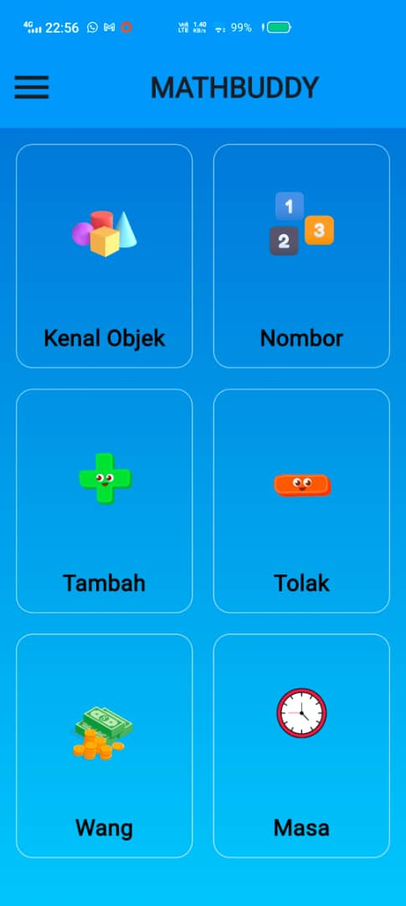

# 📘 Math Buddy

**Math Buddy** is a Flutter-based mobile app that helps students practice math questions, track progress, and build confidence. With a clean interface and gamified learning experience, Math Buddy makes learning math more engaging and effective.

---

## ✨ Key Features

- 🧮 **Math Practice Questions**  
  Organized by topic with tips and explanations for each answer.

- 🎯 **Progress Tracker**  
  Visual indicators to show completed questions and areas needing improvement.

- 🏆 **Achievements & Badges**  
  Earn awards based on accuracy, consistency, and completion.

- 👤 **User Accounts**  
  Login, Register, Forgot Password, and Profile Management functionality.

- 📈 **Topic-Based Learning**  
  Questions grouped into categories for focused study sessions.

- 📊 **Progress Bar and Feedback**  
  Track your completion and get performance feedback.

---

## 📱 Screenshots

_Add images here:_

  
  
  


---

## 💻 Tech Stack

| Tech     | Purpose                         |
| -------- | ------------------------------- |
| Flutter  | Cross-platform mobile framework |
| Firebase | Backend (optional choice)       |
| Dart     | Programming language            |

---

## 🚀 Getting Started

To run this app locally:

```bash
# Clone the repository
git clone https://github.com/hamiezann/MB-MOBILE-APP.git

# Navigate to the folder
cd math_buddy_v1

# Install dependencies
flutter pub get

# Run the app
flutter run
```
